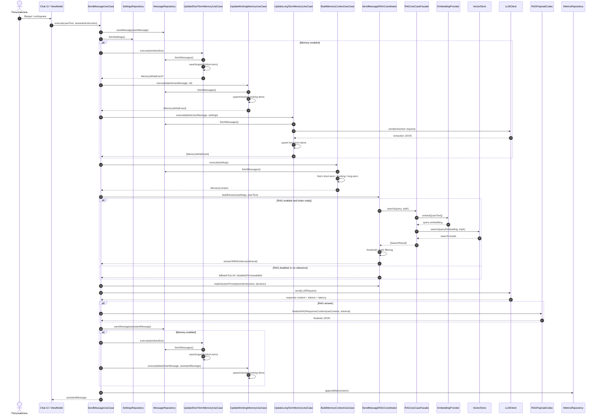

# Пайплайн обработки пользовательского сообщения

Этот документ описывает полный путь запроса от момента, когда пользователь вводит сообщение, до сохранения ответа ассистента и обновления памяти.

## Кратко

1. Пользователь отправляет текст в UI.
2. `SendMessageUseCase` сразу сохраняет сообщение пользователя в историю.
3. Если включена память, обновляются `short-term`, `working` и `long-term` слои памяти.
4. Строится `MemoryContext` для будущего запроса в LLM.
5. Координатор RAG решает, нужен ли поиск по базе документов.
6. Если RAG включен и найден релевантный контекст, выполняется поисковый запрос через embeddings.
7. Формируется `LLMRequest` и отправляется в RouterAI-совместимый endpoint.
8. Ответ ассистента сохраняется в историю.
9. После ответа повторно обновляются `short-term` и `working` memory.
10. В конце сохраняется метрика запроса.

## Подробная цепочка

### 1. Пользователь вводит сообщение

Точка входа находится в presentation-слое, но основной сценарий исполняется в `SendMessageUseCase`.

Сообщение пользователя:

- создается как `ChatMessage(role: .user, content: userText)`;
- сразу сохраняется в `MessageRepository`;
- дальше используется как источник для памяти, RAG и основного запроса в LLM.

### 2. Считываются настройки сессии

После сохранения user-message use case читает `LLMSettings` из `SettingsRepository`.

Эти настройки определяют:

- включена ли память (`isMemoryEnabled`);
- включен ли RAG (`isRAGEnabled`);
- стратегия чанкинга для RAG;
- включена ли пост-фильтрация;
- `topK` до и после фильтрации;
- порог релевантности;
- параметры модели и окна short-term memory.

### 3. Обновляется память после сообщения пользователя

Если `isMemoryEnabled == true`, выполняются три обновления.

#### 3.1 Short-term memory

`UpdateShortTermMemoryUseCase`:

- читает все сообщения текущей ветки;
- отбрасывает `system`-сообщения;
- берет последние `windowSize` сообщений;
- сохраняет snapshot в `ShortTermMemoryRepository`.

Это первая точка, где фактически перезаписывается short-term memory.

Если окно не изменилось, событие записи не создается.

#### 3.2 Working memory

`UpdateWorkingMemoryUseCase`:

- анализирует последнее сообщение пользователя;
- извлекает кандидаты по ключам вроде `task.goal`, `task.constraints`, `task.clarified_facts`, `task.terms`, `task.current_step`, `task.open_question`;
- сохраняет или обновляет элементы в `WorkingMemoryRepository`;
- при необходимости помечает некоторые ключи как resolved;
- возвращает `MemoryWriteEvent`, который сохраняется как `system`-сообщение в историю.

Важно:

- этот этап выполняется в best-effort режиме;
- ошибка рабочей памяти не должна блокировать основной ответ.

#### 3.3 Long-term memory

`UpdateLongTermMemoryUseCase`:

- берет последний user-text;
- подготавливает короткую пару сообщений `assistant -> user` для extraction;
- вызывает LLM отдельным запросом;
- просит извлечь устойчивые факты в формате JSON с ключами `profile`, `decisions`, `knowledge`;
- фильтрует результат по порогу уверенности;
- сохраняет итог в `LongTermMemoryRepository`;
- при изменениях добавляет `MemoryWriteEvent`, который тоже пишется в историю как `system`-сообщение.

Это не embeddings, а отдельный LLM-вызов для извлечения долговременных фактов.

### 4. Строится MemoryContext

`BuildMemoryContextUseCase` собирает контекст для основного ответа.

Он читает:

- `ShortTermMemoryRepository`;
- `WorkingMemoryRepository`;
- `LongTermMemoryRepository`;
- историю сообщений из `MessageRepository`.

#### Что попадает в контекст

- `shortTermMessages`:
  - сначала берется snapshot short-term memory;
  - если snapshot отсутствует, используется история сообщений без `system`;
  - список режется по `windowSize`.
- `workingMemory`:
  - только активные элементы.
- `taskState`:
  - строится из `workingMemory` по ключам `task.goal`, `task.clarified_facts`, `task.constraints`, `task.terms`.
- `longTermMemory`:
  - сортируется по приоритету namespace:
    - `profile`
    - `decisions`
    - `knowledge`
  - затем по `confidence`;
  - затем по `updatedAt`;
  - ограничивается максимумом 12 элементов.

### 5. Решается, нужен ли RAG

`SendMessageRAGCoordinator.buildDecision(settings:userText:)` делает отдельную проверку.

#### Если RAG выключен

Возвращается `disabledOrUnavailable`.

#### Если RAG включен

Координатор проверяет готовность индекса и, если нужно, индексирует документы.

Дальше возможны два режима.

##### 5.1 Пост-фильтрация включена

1. Выполняется поисковый запрос в RAG по `userText`.
2. Берется `topKBeforeFiltering`.
3. Результаты фильтруются по `ragRelevanceThreshold`.
4. Список урезается до `ragTopKAfterFiltering`.
5. Если после фильтрации ничего релевантного не осталось, выбирается fallback в обычный LLM.
6. Если результаты есть, возвращается `answerWithEvidence(retrieval:)`.

##### 5.2 Пост-фильтрация выключена

Используется legacy-режим:

- выполняется поиск с `topK = 4`;
- если лучший score ниже порога, идет fallback в обычный LLM;
- иначе возвращается `answerWithEvidence(retrieval:)`.

### 6. Когда происходит embedding

Embeddings используются только в RAG-пайплайне, не в обычной памяти.

#### 6.1 Embedding документов

Происходит при индексации RAG:

- `IndexDocumentsUseCase.execute`;
- документы парсятся;
- режутся на чанки;
- для каждого чанка вызывается `embeddingProvider.embed(texts:..., settings:...)`;
- затем `DocumentChunk` с embedding сохраняется в `VectorStore`.

Это может случиться:

- на старте приложения, если индекс предзагружается;
- или при первом RAG-запросе, если индекс еще не готов.

#### 6.2 Embedding пользовательского запроса

Происходит при поиске в RAG:

- `SearchChunksUseCase.execute(query:topK:)`;
- текст user-message передается в `embeddingProvider.embed(texts: [query], settings: ...)`;
- из результата берется один embedding;
- по нему выполняется `vectorStore.search(queryEmbedding:topK:)`.

То есть embeddings для текущего запроса создаются **до** вызова основного LLM и только если RAG действительно нужен.

### 7. Формируется system prompt

`SendMessageRAGCoordinator.makeSystemPrompt(extraInstruction:ragDecision:)` строит system prompt так:

1. Базовая инструкция:
   - `You are a helpful assistant.`
2. Если передан `assistantInstruction`, она добавляется отдельным блоком.
3. Если выбран RAG-режим `answerWithEvidence`, добавляются еще два блока:
   - JSON-контракт ответа;
   - блок `RAG_EVIDENCE` с найденными чанками.

#### Что входит в `RAG_EVIDENCE`

Для каждого результата добавляется строка вида:

- `chunk_id`
- `source`
- `section`
- `text`

Это и есть тот контекст, на который LLM должна опираться в RAG-ответе.

### 8. Формируется запрос к LLM

`LLMRequest` собирается из пяти основных частей:

- `systemPrompt`
- `taskState`
- `shortTermMessages`
- `workingMemory`
- `longTermMemory`
- `settings`

Потом `RouterAILLMClient` преобразует его в массив сообщений API.

#### Порядок сообщений в API-запросе

1. `system` message с `systemPrompt`.
2. `system` message с `TASK_STATE`, если он не пустой.
3. `system` message с `WORKING_MEMORY`, если он не пустой.
4. `system` message с `LONG_TERM_MEMORY`, если он не пустой.
5. `system` message `RECENT_DIALOG:`.
6. Все сообщения `shortTermMessages` в их исходных ролях.

#### Что именно видит модель

Модель получает:

- общий system prompt;
- при необходимости RAG-контракт и evidence;
- структурированную задачу из `taskState`;
- рабочую память;
- долговременную память;
- последние сообщения диалога.

Если RAG включен и найден контекст, модель должна вернуть строго JSON.

### 9. Выполняется основной вызов LLM

На этом этапе вызывается `llmClient.send(request:)`.

Дальше возможны два сценария.

#### 9.1 Обычный LLM-ответ без RAG

Результат LLM используется как есть.

#### 9.2 RAG-ответ

После ответа LLM запускается `RAGPayloadCodec.finalizeRAGResponseContent(...)`.

Он:

- пытается распарсить JSON;
- проверяет контракт;
- если JSON валиден, возвращает его как есть;
- если JSON сломан, ремонтирует payload на основе retrieval;
- если retrieval пустой или невалидный, возвращает fallback-пayload с сообщением уточнить вопрос.

### 10. Сохраняется ответ ассистента

Финальный `assistantMessage` сохраняется в `MessageRepository`.

В сообщение попадают:

- `content`;
- `inputTokens`;
- `outputTokens`;
- `latencyMs`.

### 11. Память обновляется после ответа ассистента

Если память включена, выполняются еще два обновления.

#### 11.1 Short-term memory

Снова пересчитывается окно последних сообщений уже с учетом ответа ассистента.

Это важно, чтобы следующий запрос видел завершенный обмен user -> assistant.

#### 11.2 Working memory

`UpdateWorkingMemoryUseCase` вызывается повторно:

- `latestUserMessage` остается тем же;
- `latestAssistantMessage` теперь содержит ответ ассистента;
- могут быть добавлены или уточнены элементы вроде `task.decision`.

После этого системные memory-events снова пишутся в историю.

### 12. Сохраняется метрика запроса

В конце создается `RequestMetric` и сохраняется в `MetricsRepository`.

Туда попадают:

- `messageID`;
- `startedAt`;
- `endedAt`;
- `latencyMs`;
- `inputTokens`;
- `outputTokens`.

## Что именно и когда сохраняется в память

### Сразу после ввода сообщения

- сохраняется user-message в историю;
- при включенной памяти обновляется short-term snapshot;
- обновляется working memory;
- обновляется long-term memory;
- системные события о memory write тоже сохраняются как `system`-сообщения.

### После ответа ассистента

- сохраняется assistant-message в историю;
- снова обновляется short-term snapshot;
- снова обновляется working memory;
- при изменениях сохраняются новые memory events.

### В RAG-индексацию

- сохраняются не сообщения, а `DocumentChunk` в `VectorStore`;
- в чанк уже входит embedding;
- это отдельное хранилище, не часть conversational memory.

## Где память не используется

Важно не путать слои:

- `short-term`, `working`, `long-term` memory не используют embeddings;
- embeddings нужны только для RAG-индекса и поиска по документам;
- long-term memory извлекается отдельным LLM-запросом, а не векторным поиском.

## Sequence Diagram

## Практический вывод

Если смотреть строго по коду, то:

- embeddings для текущего сообщения появляются только в RAG-search;
- основной LLM-запрос формируется после обновления memory context и RAG-решения;
- long-term memory обновляется отдельным LLM-вызовом до основного ответа;
- short-term и working memory обновляются дважды, до и после ответа ассистента;
- RAG-контекст попадает в `systemPrompt`, а не в отдельное поле запроса.
